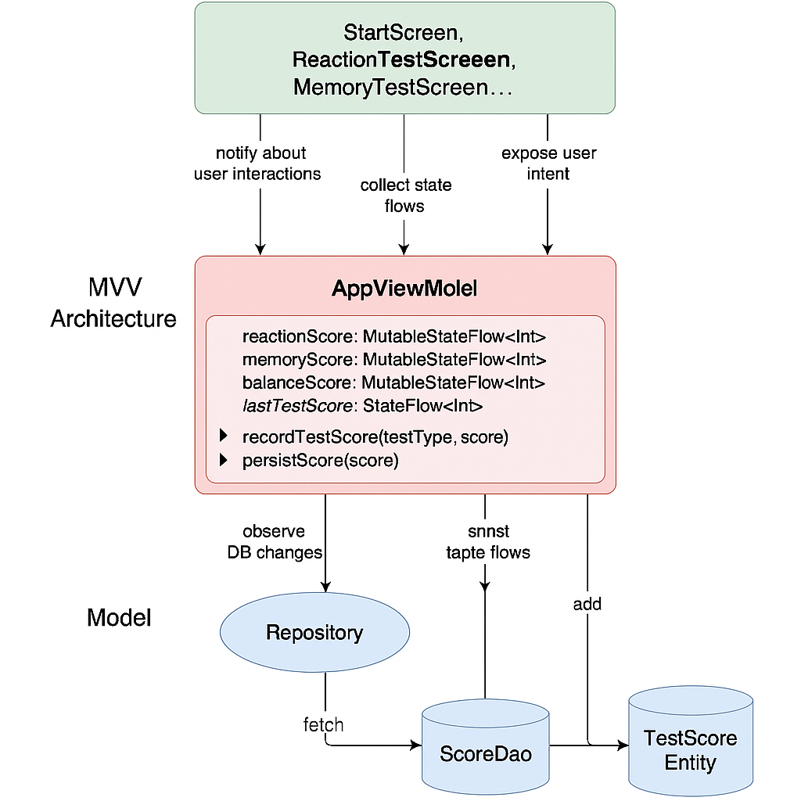

# 🧠 Sobriety Test App 🍻🚫

A modern Android application built with **Jetpack Compose** that helps assess sobriety using interactive tests measuring **reaction**, **memory**, and **balance**. This app uses **Room** for persistent score tracking and follows **MVVM architecture** with **state management** via `ViewModel`.

---

## 📱 Features

✅ Three mini-tests to assess cognitive and motor skills:  
- 🎯 **Reaction Test**: Tap the dots as fast as you can!  
- 🧩 **Memory Test**: Watch and remember sequences of dots.  
- ⚖️ **Balance Test**: Keep the dot level for as long as possible.

✅ 🧮 Score tracking after each test  
✅ 🕒 3-second countdown before each test begins  
✅ 🏆 Final score summary with percentage-based performance  
✅ 💾 Persistent storage with Room database  
✅ 📦 Clean architecture with MVVM and Compose state separation

---


## 👥 Collaboration & Task Split

This project is a team effort, with responsibilities divided as follows:

### 👨 Julian's Responsibilities
- 🔧 App setup and project scaffolding
- 🎯 Implementing the **Reaction Test**
- 🧠 Implementing the **Cognitive (Memory) Test**

### 👩 Lea's Responsibilities
- ⚖️ Implementing the **Balance Test** (requires device sensor testing)
- 📊 Final Result screen and score percentage logic
- 🧪 On-device testing and sensor calibration

I don't have an android device, which is why Lea will be doing any sensor based functionality.

---

## 🎨 Design References & Similar Apps

Here are some UI/UX inspirations and related applications that guided our design and implementation:

- [Google Fit](https://play.google.com/store/apps/details?id=com.google.android.apps.fitness): Clean UI and real-time sensor integration.  
- [Reflex Test Apps](https://play.google.com/store/search?q=reflex+test&c=apps): Simple reaction-based games for benchmarking.  
- [Brain Training Apps (e.g., Lumosity)](https://www.lumosity.com/): For cognitive and memory test inspiration.  
- [Balance Training Tools](https://play.google.com/store/search?q=balance+test+sensor&c=apps): Sensor-based exercises using the accelerometer.
- [Reaction Test Pro](https://apps.apple.com/at/app/reaction-test-pro/id493360516?l=en-GB): A reaction test using different methods of reaction speed
- [Beam Highlights](https://www.ridebeam.com/highlight/beam-introduces-rider-check-a-cognitive-test-for-enhanced-safety): A set of cognitive tests, each testing different cognition abilities, prettily designed
- [Dribble Collection](https://dribbble.com/kingjulien1/collections/7497983-sobriety-tester) a small collection of design references & ideas for our tests & app components

These references helped shape the interface, game flow, and scoring system with mobile ergonomics and clarity in mind.

---

## 💡 Miscellaneous Notes & Ideas

- Tests are modular and can be expanded (e.g., add visual illusions, coordination games).  
- Sound feedback per reaction or countdown tick would enhance immersion.  
- Average performance across users could be compared if analytics were added.  
- Could offer a "Night Mode" for dim environments.  
- Long-term idea: a calibration test baseline to personalize scoring per user.
- show result as points or as percentage?
- show comparison to average test results - “You are better than 84% of testers”
- show prompt depending on points - “You are (not) safe to drive” …
- share count down components between tests
- share same design of dots between tests
- animate from count down into testing dot / from testing dot into count down / from testing dot into result points
- show list of previous test results (save to database?)
- Device capabilities (e.g., missing gyroscope) may influence test availability.  

These thoughts are a mix of possible features and design considerations that may help extend the app into a broader cognitive tracking or training tool.

---
## 🏗️ Architecture Overview
<p align="center">
  
</p>

### 1. **MVVM + Jetpack Compose**

- **Model–View–ViewModel (MVVM)** pattern:
  - **ViewModel (`AppViewModel`)** handles all test logic and app‑wide state (reaction, memory, balance scores), using `MutableStateFlow` and `StateFlow`.
  - **View (Compose UI)** is fully declarative with no underlying XML layouts.
  - **Model** is comprised of test logic and persistence via Room.

### 2. **State Management**
- **Per-test score flows**: `reactionScore`, `memoryScore`, and `balanceScore` each `MutableStateFlow<Int>`.
- **Combined `totalScore`** uses `combine(...)` over the three flows for reactive totals.
- **`lastTestScore` flow** stores the most recent test result for display on the `ScoreScreen`.
- **Actions**:
  - `recordTestScore(testType: TestType, score: Int)` updates the related test and sets `lastTestScore`.
  - `persistScore(score: Int)` records each test score in the database via `Room`.

### 3. **Test Screen Logic (Reaction, Memory, Balance)**
- Each test screen:
  1. Shows a **3‑second countdown** using `CountdownScreen`.
  2. Executes its game logic (dot tapping, timing, motion) inside a `Composable`.
  3. Calculates score based on user performance.
  4. Calls `recordTestScore(...)` and optionally `persistScore(...)` in `AppViewModel`.
  5. Navigates to a `ScoreScreen`, which reads from `lastTestScore`.

### 4. **Reusable Layouts**
- **`StandardLayout`**: A structured header + centered content design component that ensures consistent layout across all test screens.
- **`GreenActionButton`**: Shared styled button for navigation and test actions.

### 5. **Navigation**
- Using **Jetpack Compose Navigation**.
- Fixed routes for each test and score screen:
  - `reaction_test`, `memory_test`, `balance_test`
  - `reaction_score_screen`, `memory_score_screen`, `balance_score_screen`
- Minimal use of route parameters, relying instead on `AppViewModel` for passing scores.

### 6. **Persistence with Room**
- Scores are optionally persisted via `Room` using:
  - `ScoreDao.insert(Score(points = ...))`
  - `ScoreDao.getTotalScore()` to track overall progress/history
- Toggle persistence via `persistScore(...)` in the ViewModel.

### 7. **Custom Composable Patterns**
- Game UIs utilize pure Compose, e.g.:
  - **ReactionTestScreen**: random dot tap with animation, scoring based on tap speed.
  - **MemoryTestScreen**: animated sequence display, user-tap comparisons, visual dot feedback.
  - **BalanceTestScreen**: (in development) likely uses `SensorManager` and custom composables to simulate balance challenge.

---

**📌 Summary**
- **MVVM** with `StateFlow` ViewModel & Compose UI separation  
- Logical test pipelines: countdown → gameplay → scoring → navigation  
- **Reusable design systems** and layout components  
- Optional **Room** persistence for test history  

---

## 📦 Dependencies

Be sure to include the following in your `build.gradle.kts`:

```kotlin
// Compose
implementation("androidx.compose.material3:material3:<version>")

// Navigation for Compose
implementation("androidx.navigation:navigation-compose:2.7.7")

// Room
implementation("androidx.room:room-runtime:2.6.1")
kapt("androidx.room:room-compiler:2.6.1")
implementation("androidx.room:room-ktx:2.6.1")

// ViewModel
implementation("androidx.lifecycle:lifecycle-viewmodel-ktx:<version>")
```

---

## 🛠️ To-Do

- [ ] Implement each test UI and logic
- [ ] Add countdown timer before each test
- [ ] Add transition animations
- [ ] Polish UI with custom design
- [ ] Unit tests for ViewModel and DAO

---

## 🗓️ Future Dates & Deadlines

Keep track of important project milestones:

- 📢 **Project Pitch Presentation**: May 15, 2025  
- 🚀 **Early Opportunity for Presentation**: June 24, 2025  
- 🛠️ **Final Submission Deadline**: August 31, 2025  

Make sure all implementation, testing, and documentation are finalized ahead of the final due date!

---

## ✨ Acknowledgments

- [Jetpack Compose](https://developer.android.com/jetpack/compose)
- [Android Room](https://developer.android.com/training/data-storage/room)
- [Material Design 3](https://m3.material.io/)
